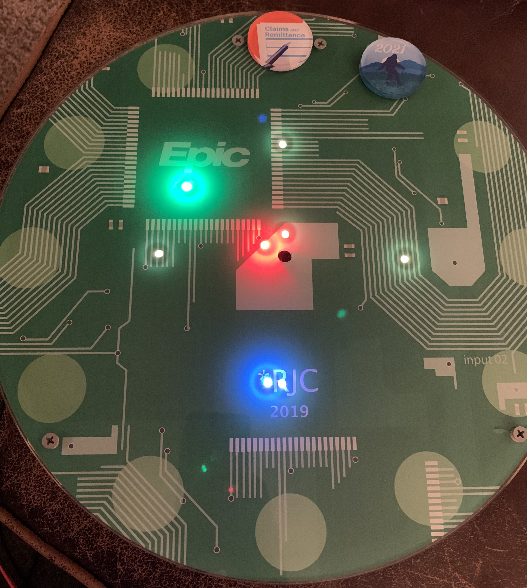

# arduino-clock
Code for an arduino-based clock that uses 72 RBG LEDs to display the time. 

## Motivation

I had a clock that I wanted to put in my office, but I didn't want to be bothered by the ticking noise that it 
would make. So, I replaced the clock hands with two rings of RBGW LEDs. The inner ring has 12 LEDs to show
the hour, and the outer ring has 60 LEDs to show the minutes and seconds. The microcontroller uses WiFi to 
determine the time on startup (and resync the time every so often because microcontrollers can be pretty bad at
keeping time).  

## Hardware

#### Basic Parts
- [ESP32 Board](https://www.adafruit.com/product/3591)
- [Small NeoPixel LED ring](https://www.adafruit.com/product/2852)
- [Large NeoPixel LED 1/4 ring](https://www.adafruit.com/product/2874)
- [Rotary Dial](https://www.adafruit.com/product/377) and [Rotary Encoder](https://www.adafruit.com/product/4991)
- [3V to 5V Shifter](https://www.adafruit.com/product/1787)

#### Other Hardware Details
I soldered it all together on a protoboard.  I wanted to just use a breadboard, but I was concerned that having all the LEDs at max brightness would draw too much current for the breadboard connectors.  So, to the soldering iron I went.  There's a toggle switch on the back that disconnects the signal wire for the LEDs (scroll down to see the hardware).  The red and black wires going into the bottom corner of the protoboard are 5V and neutral power from a 5V power supply.  That powers the ESP32 and LEDs when the clock is hanging on a wall.  But, when the board is having its software updated from the micro USB port (in which case, the 5V power supply must be unplugged), the LEDs could draw more power than the ESP32 can supply.  For that reason, I added the toggle switch that disconnects the signal wire for the LEDs, ensuring they draw a negligible amount of power.  There are capacitors over the power busses to absorb a spike in voltage when power supplies are turned on or plugged in, which is what the LED manufacturer recommended.   

## Features
- [x] Be able to display the current time
- [x] Wrapper for time functions to account for the microcontroller's inaccuracy
- [x] Change the seconds and minutes display to a smooth animation
- [ ] Animation to play when the hour changes
- [ ] Utilize multiple wifi connection options
- [ ] Use a background process to sync time instead of waiting in the foreground
- [ ] Second microcontroller with rotary encoder to set timers

## Pics or it didn't happen

"This sounds cool and all...but I have no clue what this thing actually looks like" - you, probably

Here is the clock displaying a time of 10:31 and I'll guess 51 seconds:

Here is the back of the clock:

